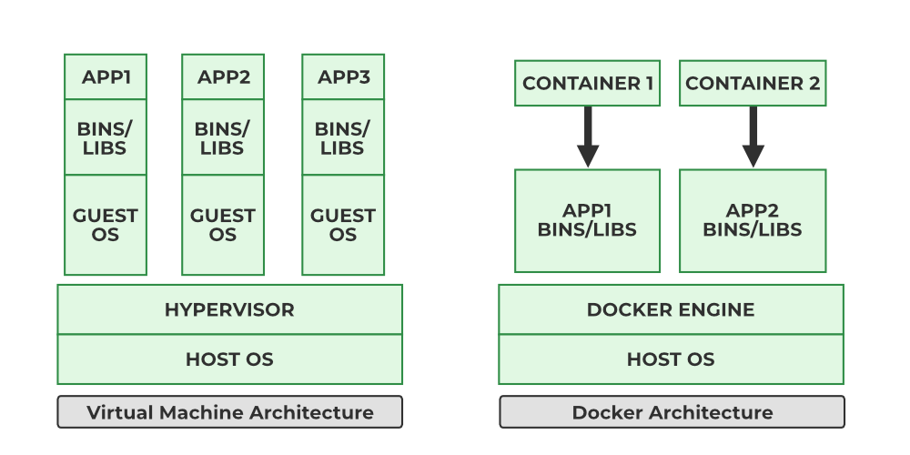
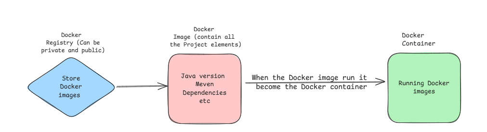

<h1>
  
</h1>

* * *

## What is Docker?

Docker is an **open-source containerization platform** that allows you to package applications and their dependencies into lightweight, portable units called **containers**.  
These containers can run consistently across different environments — from your local machine to production servers — without worrying about environment mismatches.

* * *

## Why use Docker?

*   **Portability** – Run the same application anywhere (dev, test, prod).
*   **Consistency** – Eliminate “works on my machine” issues.
*   **Isolation** – Run multiple apps without dependency conflicts.
*   **Resource Efficiency** – Containers share the host OS kernel, making them lighter than virtual machines.
*   **Faster CI/CD** – Build, test, and deploy applications quickly.
    

* * *

<table>
<tr>
<td>

## Docker vs Virtual Machines

| Feature | Docker Containers | Virtual Machines | 
| --- | --- | --- |
| OS | Share host OS kernel | Full guest OS |
| Size | MBs | GBs |
| Startup time | Seconds | Minutes |
| Isolation | Process-level | Hardware-level |
| Performance | Near-native | Slight overhead |

</td>
<td>

</td>
</tr>
</table>

* * *

<table>
<tr>
<td>

## Key Terms

* **Image** – Read-only template for creating containers.  
* **Container** – Running instance of an image.  
* **Docker Engine** – The runtime that builds and runs containers.  
* **Registry** – Storage for images (e.g., Docker Hub).  
* **Layer** – Incremental changes in an image.  

</td>
<td>

</td>
</tr>
</table>

    

* * *

## Quick Start Example

    # Run a test container
    docker run hello-world
    

**What happens here?**

1.  Docker checks for the `hello-world` image locally.
2.  If not found, it pulls it from Docker Hub.
3.  Creates and starts a container from the image.
4.  Runs the container’s main process and prints a message.
    
